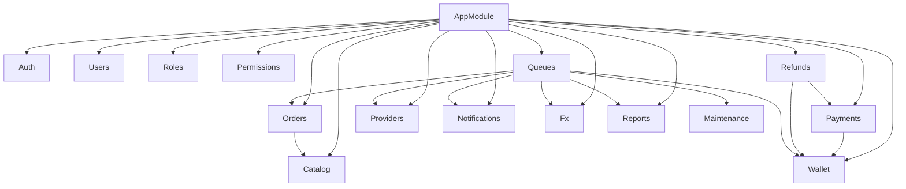

# Patron — Architecture Review

**Date:** 2026-07-22
**Scope:** Post-monorepo-restructure audit of the Patron platform
**Nature:** Read-only technical review. No code was modified.

> This report audits the repository after the Turborepo restructure. The
> backend (`apps/api`) carries a mature NestJS codebase; the admin and mobile
> apps are structural scaffolds. Metrics (line counts, module lists, SQL sites)
> were gathered mechanically; judgements are called out as such.

---

## 1. Current folder structure

```
patron/
├── apps/
│   ├── api/                     NestJS backend (the entire business system)
│   │   ├── src/
│   │   │   ├── common/          cross-cutting infrastructure (see §2)
│   │   │   │   ├── audit/ context/ crypto/ decorators/ dto/ filters/
│   │   │   │   ├── guards/ health/ idempotency/ locking/ logging/
│   │   │   │   ├── metrics/ money/ outbox/ prisma/ reference/ tracing/
│   │   │   ├── config/          configuration + env validation
│   │   │   ├── modules/         domain modules (see §2)
│   │   │   │   ├── auth/ catalog/ fx/ maintenance/ notifications/
│   │   │   │   ├── orders/ payments/ permissions/ providers/ queues/
│   │   │   │   ├── refunds/ reports/ roles/ users/ wallet/
│   │   │   ├── app.module.ts    main.ts    worker.ts    tracing.ts
│   │   ├── prisma/              schema, migrations, seed  (see §4)
│   │   ├── test/               unit / integration / e2e / resilience / load
│   │   ├── Dockerfile  package.json  package-lock.json  tsconfig.json
│   ├── admin/                   Next.js (App Router) + Tailwind — scaffold
│   │   └── app/ (layout.tsx, page.tsx, globals.css)
│   └── mobile/                  Flutter — scaffold (lib/main.dart)
├── packages/
│   ├── tsconfig/                shared TS base configs  (see §5)
│   └── types/                   shared type contracts   (see §5, currently empty)
├── deploy/                      k8s, nginx, prod compose, ops scripts
├── docs/                        ADRs + operations docs + this review
├── docker-compose.yml  turbo.json  package.json  CLAUDE.md
```

Structural counts (apps/api/src): **24 NestJS modules**, **15 controllers**,
**33 services**, **~9,272 lines** of TypeScript. The domain is split
`common/` (infrastructure) vs `modules/` (business) — a clean, conventional
separation.

---

## 2. NestJS modules

24 modules total, plus the root `AppModule`. Grouped by role:

### Infrastructure (`src/common/*`) — 10 modules, 8 are `@Global`

| Module | Global | Responsibility |
|---|---|---|
| `PrismaModule` | ✅ | Prisma client lifecycle |
| `CryptoModule` | ✅ | AES-256-GCM encrypt/decrypt at rest |
| `OutboxModule` | ✅ | Transactional outbox write side |
| `IdempotencyModule` | ✅ | Idempotency-Key storage + interceptor |
| `AuditModule` | ✅ | Append-only audit log |
| `ReferenceModule` | ✅ | Human-readable reference-number generation |
| `MetricsModule` | ✅ | Prometheus registry + `/metrics` |
| `TracingModule` | ✅ | OpenTelemetry span helpers |
| `HealthModule` | — | liveness/readiness probes |
| *(no module)* | — | `context/`, `decorators/`, `filters/`, `guards/`, `locking/`, `logging/`, `money/` are provider-less utilities |

### Domain (`src/modules/*`) — 14 modules

| Module | Controllers | Key services | Exports |
|---|---|---|---|
| `AuthModule` | `auth` | `AuthService`, `TokenService`, `JwtStrategy` | Auth, Token |
| `UsersModule` | `users` | `UsersService` | Users |
| `RolesModule` | `roles` | `RolesService` | Roles |
| `PermissionsModule` | `permissions` | `PermissionsService` | Permissions |
| `CatalogModule` | `catalog`, `admin/catalog` | `Categories`, `Games`, `Products`, `Pricing` | Pricing, Products |
| `OrdersModule` | `checkout`, `orders`, `admin/orders` | `OrdersService`, `QuotesService` | Orders, Quotes |
| `PaymentsModule` | `payments`, `webhooks` | `PaymentsService`, `GatewayRegistry`, `Wallet`/`Stripe` gateways | Payments, GatewayRegistry |
| `RefundsModule` | `admin/refunds` | `RefundsService` | Refunds |
| `WalletModule` | `wallet` | `WalletService` | Wallet |
| `ProvidersModule` | `admin/providers` | `ProviderEngine`, `ProviderRegistry`, adapters | Engine, Registry, Providers |
| `NotificationsModule` | `notifications` | `NotificationsService` + channels | Notifications |
| `FxModule` | `admin/fx` | `FxService` | Fx |
| `ReportsModule` | `admin/reports` | `ReportsService`, `AnalyticsService`, `ReportExportService`, `RollupService` | Reports, Analytics, Rollup |
| `MaintenanceModule` | — | `RetentionService`, `RollupService` | Retention, Rollup |
| `QueuesModule` | — | `OutboxRelay` + BullMQ processors | — |

> **Note:** several modules host **multiple controllers per file** — `catalog`
> (public + admin), `orders` (checkout + user + admin), `payments`
> (payments + webhooks). This is intentional and reasonable, but means the
> controller *file* count (15) understates the **19 `@Controller` classes**.

---

## 3. Dependency graph between modules

`ConfigModule`, `ThrottlerModule`, `LoggerModule` and the 8 `@Global`
infrastructure modules are available everywhere and are omitted from the graph
below. Edges show **explicit `imports`** in each `@Module`.



**Module-level import edges**

| Module | Imports |
|---|---|
| `OrdersModule` | `CatalogModule` (shared `PricingService`) |
| `PaymentsModule` | `WalletModule` |
| `RefundsModule` | `WalletModule`, `PaymentsModule` |
| `ReportsModule` | *(BullMQ queue registration only)* |
| `QueuesModule` | `Orders`, `Providers`, `Notifications`, `Fx`, `Wallet`, `Reports`, `Maintenance` |

**Source-level couplings** (direct file imports, not via DI `imports`) — found
by scanning `*.service.ts`:

| From | Imports symbol | From module | Wired via DI import? |
|---|---|---|---|
| `orders/quotes.service` | `PricingService` | catalog | ✅ yes |
| `refunds/refunds.service` | `WalletService`, `GatewayRegistry` | wallet, payments | ✅ yes |
| `payments/payments.service` | `assertTransition` (pure fn) | orders | ⚠️ **no** — file-level import of `orders/order-state.machine` while `PaymentsModule` does not import `OrdersModule` |
| `reports/reports.service` | `RollupService` (class) | maintenance | ⚠️ **re-provided** locally (see §6/§7) |

**Observations (judgement):**

- `QueuesModule` is a **coupling hub**: it imports 7 domain modules to feed its
  processors. This is inherent to a queue orchestrator but makes it the most
  fan-in-heavy module and a change amplifier.
- The `payments → orders` coupling is a *shared pure function*
  (`assertTransition`). It works because the symbol is not injectable, but it is
  an implicit cross-domain dependency that the module graph does not express.

---

## 4. Prisma location and configuration

| Aspect | Value |
|---|---|
| Location | `apps/api/prisma/` (API-scoped; **not** a shared package) |
| Schema | `apps/api/prisma/schema.prisma` — **1,138 lines** |
| Datasource | `provider = "postgresql"`, `url = env("DATABASE_URL")` |
| Generator | `prisma-client-js`, **default output** (`node_modules/.prisma/client`) |
| Models | **40** |
| Enums | **15** |
| Indexes/uniques | **71** (`@@index` / `@@unique`) — indicates deliberate query tuning |
| Migrations | **4** applied (`init` → `quotes_and_reliability` → `reporting_and_observability` → `scale_hardening`) |
| Seed | `ts-node prisma/seed.ts` (via `package.json#prisma.seed`) |
| Client access | Centralised in `common/prisma/PrismaService` (global) |
| Drift protection | CI `api-drift` job diffs migrations vs schema against a shadow DB |

**Observations (judgement):**

- Config is clean and idiomatic. Convention-based encryption (`*Enc` fields,
  see schema header) is enforced at the app layer via `CryptoService`, not by
  Prisma.
- No `binaryTargets` are pinned in the generator. The API's Alpine-based
  Docker image relies on Prisma auto-detecting `linux-musl-openssl`; that
  works today but is worth pinning explicitly for reproducibility.
- Prisma living inside `apps/api` is correct for now (the API is the sole DB
  owner). If the admin dashboard ever needs typed DB access, promote the
  client to a `packages/db` workspace rather than importing across apps.

---

## 5. Shared packages and their responsibilities

| Package | Responsibility | Status |
|---|---|---|
| `@patron/tsconfig` | Shared TS base configs (`base.json`, `nestjs.json`, `nextjs.json`) | **Consumed** by `apps/api` and `apps/admin` ✅ |
| `@patron/types` | Shared framework-agnostic type contracts (DTOs, enums) | **Empty and unconsumed** — placeholder only ⚠️ |

**Observations (judgement):**

- `@patron/tsconfig` is doing real work — both TS apps extend it.
- `@patron/types` currently exports `{}`. It is scaffolding for future
  API↔admin contract sharing. Until the admin app consumes API types, it adds a
  build target with no consumers. Acceptable as intentional scaffolding, but
  it should either gain its first real contract soon or be documented as
  "reserved."
- There is **no shared package for DB access or API client**. When the admin
  dashboard starts calling the API, a generated client / shared DTO layer will
  be the natural next `packages/*` entry.

---

## 6. Circular dependencies

**None found.** Evidence:

- `grep forwardRef src` returns only **comments** (`refunds.module`,
  `refunds.controller`) explaining that a cycle was *deliberately removed*
  rather than papered over with `forwardRef`. No `forwardRef()` call exists in
  the codebase.
- The module import graph (§3) is a DAG: `catalog` and the leaf domains have no
  domain imports; `orders → catalog`; `payments → wallet`;
  `refunds → {wallet, payments}`; `queues → {many}`; no back-edges.
- The one implicit coupling (`payments → orders` via `assertTransition`) is
  one-directional; `orders` does not depend on `payments`.

This is a **strength** — the team has been disciplined about acyclicity.

---

## 7. Duplicated code

Concrete, verified instances (not stylistic):

1. **Duplicated/conflicting decorators — `reports.controller.ts` `export()`**
   The endpoint stacks **three `@ApiOperation`** and **three `@Throttle`**
   decorators (`default:5`, `default:10`, `expensive:5`). Copy-paste residue;
   the effective rate limit is ambiguous. *(bug-grade debt)*
2. **Duplicated/conflicting decorators — `payments.controller.ts` `handle()`**
   The webhook stacks **two `@ApiOperation`** and **two `@Throttle`**
   (`default:300` then `default:600`). *(bug-grade debt)*
3. **`AuditModule` imported twice** in `app.module.ts` (lines 59 and 63). Nest
   de-dupes, but it is dead duplication.
4. **`RollupService` registered in two modules** — provided by both
   `MaintenanceModule` and `ReportsModule` (and both `export` it). Produces two
   independent instances of a stateful rollup service (see §6/§12).
5. **Totals reducer duplicated** in `reports.service.ts` — the
   `series.reduce(... {orders, gross, refunds, net} ...)` block is copied
   verbatim between `revenue()` and `revenueFromRollup()`.
6. **`BullModule.registerQueue([...3 queues])`** is repeated in
   `queues.module.ts` and `reports.module.ts` with the same three queue names.

**Low duplication overall:** the provider adapters correctly share
`base-http.adapter.ts`, pagination is centralised in `common/dto`, and there
are **0 `eslint-disable`** and **0 explicit `any`** in non-test code.

---

## 8. Large modules that should be split

| Module | Size signal | Judgement |
|---|---|---|
| `ReportsModule` | `reports.service` 478 + `analytics.service` 287 + export + rollup | **Split candidate.** `reports.service` mixes ~10 distinct report queries (revenue, profit, providers, products, customers, currencies, refunds, failures, queues). Consider splitting by report family or extracting the raw-SQL query builders. |
| `OrdersModule` | `orders.service` 370 + `quotes.service` 331 | **Watch.** Already split checkout/quotes from orders; `orders.service` still spans create-from-quote, listing, reveal, cancel, admin. A `reveal`/delivery concern could move out. |
| `QueuesModule` | imports 7 domain modules | **Structural, not size.** It is a fan-in hub by design; keep it thin (wiring only) and ensure no business logic leaks into processors. |

No module is alarmingly large; the codebase favours many small services (33
services averaging ~160 lines).

---

## 9. Controllers containing business logic

Controllers are **overwhelmingly thin delegators** — the audit of the five
largest confirms they mostly map routes to a single service call.

**Exception — `reports.controller.ts` `export()`** contains real logic:

- an inline **dispatch map** (`sources: Record<string, () => Promise<unknown>>`)
  wiring report names to service calls and reshaping results
  (`.series`, `.byReason`, `.topCustomers`, `.cohorts` …);
- **input validation** (unknown-report → `res.status(400)` with a message);
- response-shaping (`content-disposition`, casting rows).

This report-name → data-source routing belongs in `ReportExportService`
(which already owns `filename()` and `toCsv()`). *(judgement)*

**Minor:** `auth.controller.ts` has a private `meta()` helper assembling
`{ip, userAgent, deviceInfo}`. This is acceptable request-plumbing, not
business logic. All other controllers delegate cleanly.

---

## 10. Services larger than 300 lines

| Service | Lines | Notes |
|---|---|---|
| `reports/reports.service.ts` | **478** | Many report queries + raw SQL; top split candidate (§8). |
| `orders/orders.service.ts` | **370** | Order lifecycle: create-from-quote, list, reveal, cancel, admin. |
| `orders/quotes.service.ts` | **331** | Quote creation with frozen price/FX/cost/tax. |

Three services exceed 300 lines. The next tier
(`analytics` 287, `auth` 283, `products` 281, `provider-engine` 277) sits just
under the threshold and is worth watching but not splitting.

---

## 11. Files larger than 500 lines

**None.** The largest TypeScript file is `reports.service.ts` at **478 lines**.
For reference, `prisma/schema.prisma` is 1,138 lines but is a declarative schema,
not code. File sizes are healthy across the board.

---

## 12. Technical debt list

| # | Item | Severity | Location |
|---|---|---|---|
| 1 | Conflicting `@Throttle`/`@ApiOperation` decorators — effective rate limit ambiguous on a **money endpoint** | High | `payments.controller` `handle()`, `reports.controller` `export()` |
| 2 | `RollupService` double-registered → two stateful instances; nightly rollup could run/compute twice or diverge | Medium–High | `maintenance.module` + `reports.module` |
| 3 | Report-export dispatch/validation logic lives in the controller | Medium | `reports.controller` `export()` |
| 4 | `@patron/types` empty and unconsumed (shared-contract layer not yet real) | Low | `packages/types` |
| 5 | Implicit `payments → orders` coupling via `assertTransition` not expressed in module graph | Low–Medium | `payments.service` |
| 6 | `AuditModule` imported twice in `AppModule` | Low | `app.module.ts` |
| 7 | Duplicated totals reducer in `reports.service` | Low | `reports.service` |
| 8 | Prisma `binaryTargets` not pinned (relies on musl auto-detect in Docker) | Low | `prisma/schema.prisma` |
| 9 | Worker boots the **full HTTP module graph** (`createApplicationContext(AppModule)`) — instantiates controllers/guards it never uses | Low | `worker.ts` |
| 10 | Two lockfiles per app (root + per-app) can drift (documented trade-off in `CLAUDE.md`) | Low | repo-wide |
| 11 | One tracked `TODO` (notifications hand-off) | Info | `auth.service.ts:198` |

---

## 13. Security observations

**Strengths (verified):**

- **Global defense-in-depth guard chain** (order enforced in `AppModule`):
  `ThrottlerGuard → JwtAuthGuard → PermissionsGuard`. Public routes opt out via
  `@Public()`.
- **Tiered rate limiting** (`default`/`strict`/`expensive`) with per-route
  overrides; the code-reveal and auth endpoints are tightly limited.
- **Encryption at rest** (AES-256-GCM) for sensitive fields via `CryptoService`;
  delivered codes are revealed through a **separate, audited** endpoint so they
  never appear in list responses/logs.
- **Webhook signature verification against the raw body** (`rawBody: true`),
  with replay protection via a unique `(source, eventId)` constraint.
- **Raw SQL is parameterized.** All `$queryRawUnsafe`/`$executeRawUnsafe` sites
  pass values as positional params (`$1..$3`); the only interpolated tokens are
  **identifiers from internal constants** — a `TABLE_BY_RANK` enum map
  (`locking/lock-order.ts`) and hardcoded policy table/column names
  (`retention.service`). No user input reaches SQL text. Bucket granularity is
  whitelisted. **No injection vector found.**
- Non-root, healthchecked Docker image; CI runs gitleaks, CodeQL, `npm audit`,
  Trivy, and a "no secret-shaped files tracked" check.

**Concerns:**

1. **`/metrics` auth is bypassable when unconfigured.** The guard is
   `if (expected && auth !== 'Bearer '+expected) throw ...`. If
   `METRICS_TOKEN` is empty/unset, the endpoint is **open**, exposing revenue,
   order volume and provider relationships (the code comment itself flags the
   sensitivity). Recommend failing closed (deny if no token configured) or
   asserting the token is present at boot. *(judgement)*
2. **Conflicting `@Throttle` decorators** (§7/§12-1) leave the real limit on the
   payment webhook and report export ambiguous — a rate-limit control whose
   value can't be read from the code is a weak control.
3. `npm audit` reports **54 advisories (46 moderate, 8 high)** in the api
   dependency tree at review time (transitive). None confirmed exploitable here,
   but the high-severity set should be triaged.
4. **Dependency on `npx` fetching the Prisma CLI at runtime** (migrate step,
   `--omit=dev`) pulls an unpinned tool over the network during deploy —
   supply-chain surface. Consider bundling the CLI.

*No secrets are committed; `.env.example` files carry only placeholders.*

---

## 14. Performance observations

**Strengths (verified):**

- **Rollup vs. live split** in reporting: historic ranges read pre-aggregated
  `daily_rollups`; only ranges touching *today* hit the live tables. Explicit,
  well-reasoned (`revenue()` vs `revenueFromRollup()`).
- **Aggregation pushed into PostgreSQL** (raw SQL with `date_trunc`,
  `FILTER`, CTEs) rather than pulling rows into Node — the file header states
  this as a deliberate policy.
- **Keyset/cursor pagination** (`common/dto/cursor.dto.ts`) — avoids deep-offset
  scans (ADR "scale hardening").
- **71 indexes/uniques** in the schema; a dedicated `scale_hardening` migration.
- **Worker/API process separation**: a 20s provider call cannot affect API
  latency; workers scale independently.
- **Chunked, yielding deletes** in `retention.service` so the sweeper never
  starves foreground writes; row-lock ordering (`lock-order.ts`) prevents
  deadlocks.

**Concerns:**

1. **Duplicate `RollupService` instances** (§12-2) waste work if both run, and
   risk inconsistent rollups feeding the "fast path" reports.
2. **Reports are the heaviest queries** and the export path runs them **live**
   (`revenue`/`profit` `.series`) rather than from rollups; combined with the
   ambiguous throttle, a dashboard/export loop is a plausible self-inflicted
   load source. Throttle is intended to mitigate — make it unambiguous.
3. **Worker loads the full HTTP graph** (§12-9): extra memory/instantiation for
   controllers and guards the worker never serves.
4. No evidence of N+1 in the audited services (aggregation is set-based), but
   the live report queries join `orders × order_items` over a date range —
   verify these hit the intended composite indexes under production cardinality.

---

## 15. Suggested architecture improvements

Ordered by value-to-effort. **None of these are business features** — they are
structural/quality changes.

1. **Fix the conflicting decorators** (§7-1/2). Reduce each endpoint to a single
   intentional `@Throttle` and `@ApiOperation`. Highest-value, lowest-effort;
   removes a bug on money-handling routes.
2. **Single-home `RollupService`.** Provide/own it in `MaintenanceModule` only;
   have `ReportsModule` `import` maintenance and drop `RollupService` from its
   providers. Eliminates the duplicate-instance class of bug.
3. **Move report-export routing into `ReportExportService`.** The controller
   should call `exporter.export(report, dto, res)`; the `sources` map and
   unknown-report handling belong beside `filename()`/`toCsv()`.
4. **Make `/metrics` fail closed.** Require `METRICS_TOKEN` at boot (env
   validation) or deny when unset, so observability data is never accidentally
   public.
5. **Express the `payments → orders` coupling** honestly. Either move
   `assertTransition`/the order state machine into a shared, importable place
   (e.g. an `orders` public surface or a small shared kernel) or have
   `PaymentsModule` import `OrdersModule`. Avoid silent cross-domain file
   imports.
6. **Split `reports.service.ts`.** Extract per-family query services
   (revenue/profit, provider, product, customer) or a raw-SQL query-builder
   layer; keep `ReportsService` as a thin façade. Same for watching
   `orders.service` as it grows.
7. **Give the worker a lean module.** Introduce a `WorkerModule` importing only
   queues + the domain modules processors need, instead of the whole
   `AppModule`, so the worker doesn't instantiate HTTP controllers/guards.
8. **Grow `@patron/types` into a real contract layer** (or mark it reserved).
   As the admin dashboard begins calling the API, share request/response DTOs
   and enums here; consider a generated API client and, if the dashboard needs
   DB types, a `packages/db` for the Prisma client.
9. **Pin Prisma `binaryTargets`** for the Alpine runtime and **bundle the Prisma
   CLI** into the image to remove the runtime `npx` fetch.
10. **De-duplicate infra config**: remove the double `AuditModule` import and the
    repeated `BullModule.registerQueue`; consider a small helper for the shared
    queue registration.

---

### Appendix — how metrics were gathered

- Structure/counts: `find`, `wc -l` over `apps/api/src`.
- Modules/graph: parsed `@Module({...})` `imports`/`providers`/`exports` and
  cross-file `import` statements in `*.service.ts`.
- SQL safety: located every `$queryRaw*`/`$executeRaw*` site and inspected
  parameterization and identifier sources.
- Debt/quality: `grep` for `any`, `eslint-disable`, `TODO/FIXME`, `forwardRef`,
  duplicated provider registrations.

*No files were modified during this review.*
